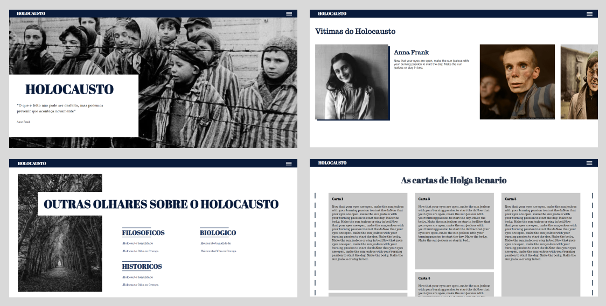

<h1 align="center"> HOLOCAUSTO </h1>

  <a href="#projeto ">Projeto</a>&nbsp;&nbsp;&nbsp;|&nbsp;&nbsp;&nbsp;
  <a href="#tecnologias">Tecnologias</a>&nbsp;&nbsp;&nbsp;|&nbsp;&nbsp;&nbsp;
  <a href="#layout">Layout</a>

  

  

## PROJETO
Esse projeto orientado pelos professores responsáveis do PPA (Projete de Pratica Articuladora) tem como objetivo trazer através de um site, o qual será desenvolvido por nós estudantes do curso de TI , o tema Holocausto, onde traremos fatos, relatos, discursões  entre outras pontos, que serão apresentados nesse projeto. [ACESSE AQUI](https://htppsvitor.github.io/LinkMy/).

 

### TECNOLOGIAS 

   

   

   
  
   

   

